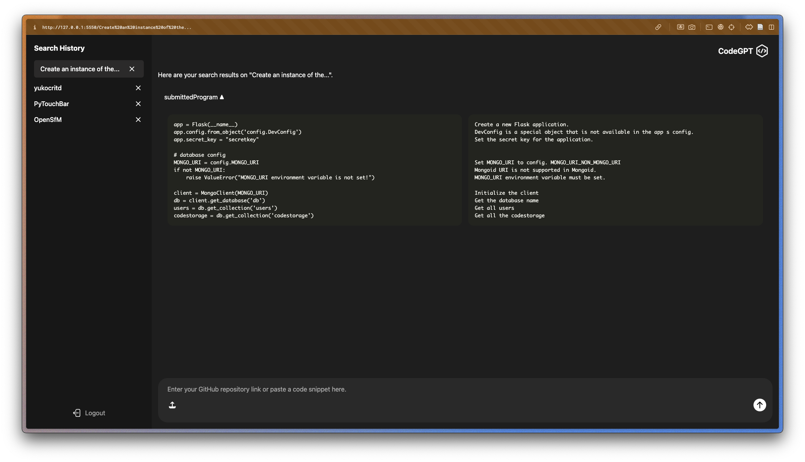
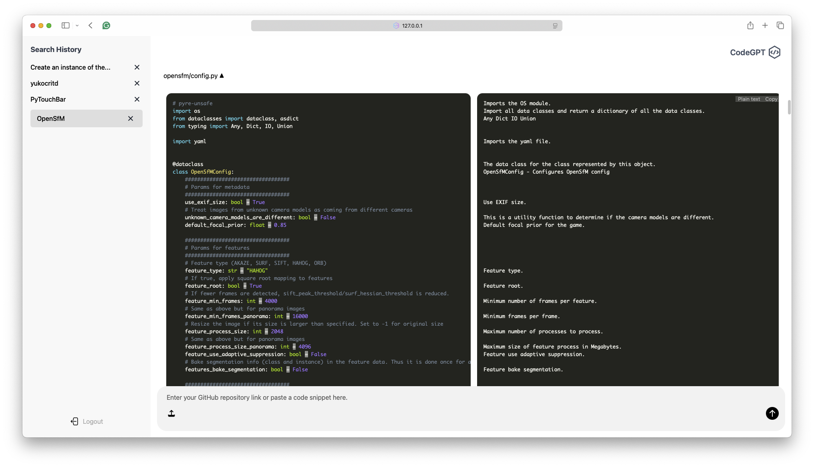
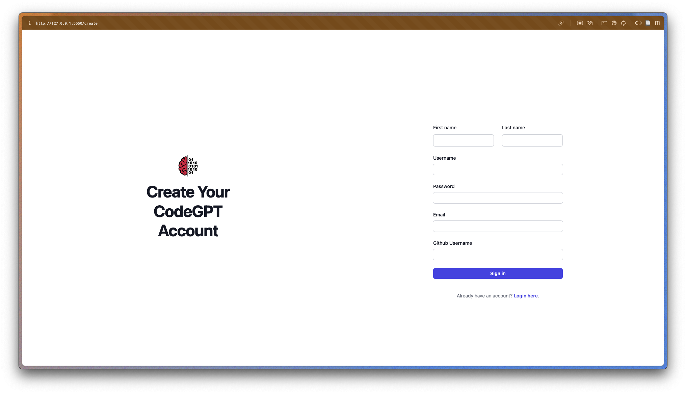

# CodeGPT

## What it does 
CodeGPT enables users to submit either a GitHub repository link or a code snippet, which it then processes to generate a detailed, line-by-line summary in plain text. When a GitHub repository link is provided, our app leverages the GitHub API to explore all the files in the repository and retrieve the code from each file. Using the fine-tuned CodeT5 model from Hugging Face, it summarizes all the code within the repository. Both the original code and its corresponding summary are displayed side by side, making it easier for developers to understand the code. Additionally, users who create an account can have their past searches saved for quick access in the future. 

## Screenshots

